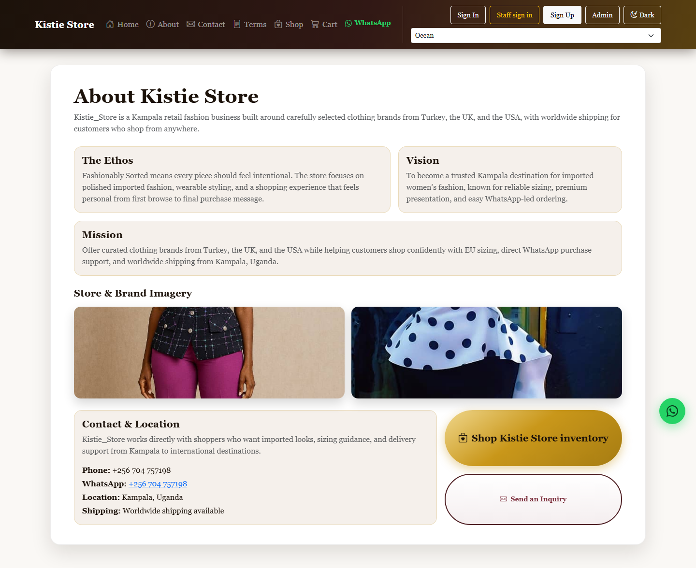
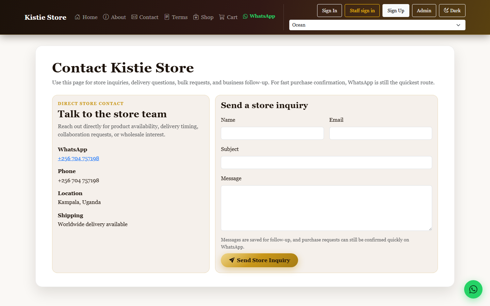
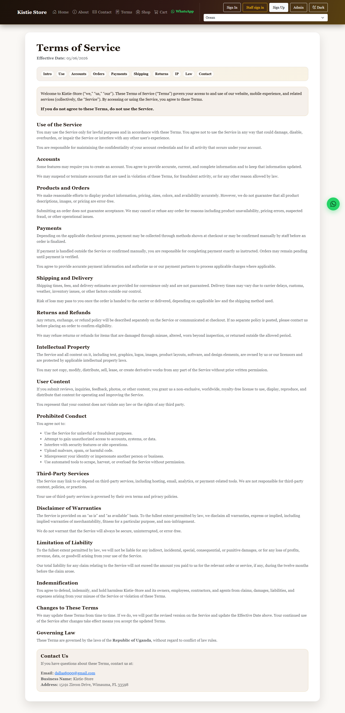
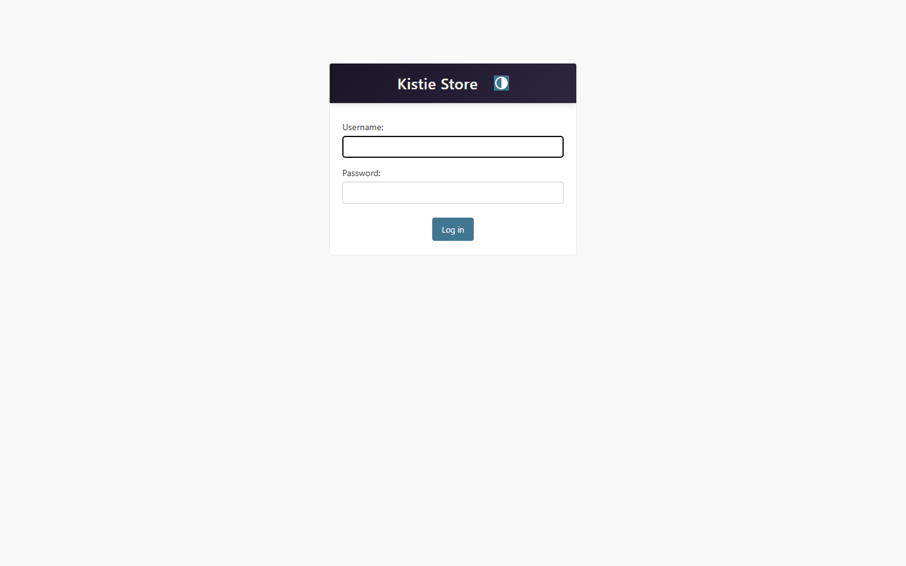
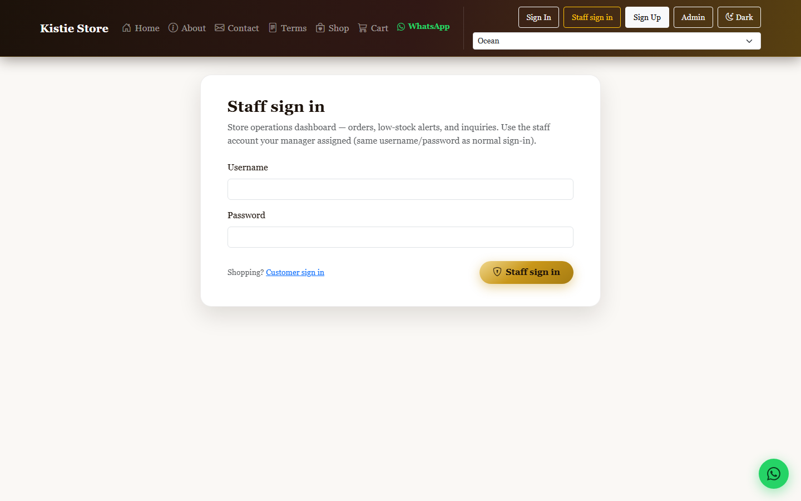

# Kistie-Store


[](https://github.com/dallas8000-ops/Kistie-Store/actions/workflows/ci.yml)


Live **fashion ecommerce** (women’s apparel & accessories)—shipping from **Kampala**, serving customers online worldwide. Production **Django** storefront + staff tooling + **DRF** API on **Render** / **PostgreSQL**, **tests + CI** on every push to `main`.


| | |

|--|--|

| **Live** | **[Kistie-Store](https://kristie-store.onrender.com)** on Render — `https://kristie-store.onrender.com` |

| **Code** | https://github.com/dallas8000-ops/Kistie-Store |

| **Trello** | https://trello.com/b/s8Rpm9in/kistie-store |

| **Planning** | [PROJECT_PLANNING.md](PROJECT_PLANNING.md) |


---


## What it does (short)


**Shoppers:** the storefront is **one Shop page** (`/shop/`). Opening **`/`** sends visitors straight there. Everything you browse—filters (category, price), EU sizing, currency & payment choices, product quick-view modal, add to cart—lives in that single Shop template (`core/shop.html`). Then cart → checkout, auth, contact. **There is no separate “catalog” or “inventory” screen** in the UI; former URLs only redirect for old bookmarks (see note below).


**Payments** are confirmed by staff in the real world; order status is updated in **Django admin** (typical for boutique + East Africa payment mix).


**Operations:** custom-theme **Django admin**, **staff dashboard** (`/staff/dashboard/`), **audit log** for superusers, CSRF + login throttling, **public read / staff-only write** on the JSON API (REST routes live under **`/api/inventory/`** as a URL prefix only—not a second storefront).


**Why this stack:** Django **SSR** for the live path (SEO, sessions, security); **React + Vite** in `frontend/` for experiments/future pages; DRF exposes JSON for integrations.


---


## Repository layout


Paths below are from the **repository root** (same layout CI and Render use).


- **`requirements.txt`** — Python dependencies. Install with `pip install -r requirements.txt`, then run Django from **`backend/`** (`python manage.py …`).
- **`backend/`** — Django project: `manage.py`; **`core/`** (settings, root `urls.py`, middleware, templates under `core/templates/core/`); **`inventory/`** (product models + DRF, mounted at `/api/inventory/`); **`cart/`**; **`pages/`** (e.g. contact inquiry model).
- **`frontend/`** — Vite + React (`package.json`, app code under `frontend/src/`). Used for experiments / future SPA work; **production storefront HTML is rendered by Django**, not this bundle.
- **`payments/`** — Node service for Pesapal redirect handling (`package.json`).
- **`scripts/`** — Automation such as [`scripts/capture_screenshots.py`](scripts/capture_screenshots.py).
- **`docs/`** — Static materials such as [`docs/demo-presentation.html`](docs/demo-presentation.html).
- **`images/`** — Source imagery; **`images/screenshots/`** — README screenshot gallery (see **Proof — screenshots** below).
- **[`.github/workflows/ci.yml`](.github/workflows/ci.yml)** — installs root `requirements.txt`, then `cd backend && python manage.py test`.
- **[`render.yaml`](render.yaml)** — Render web service (`gunicorn --chdir backend`), Postgres, migrate/collectstatic build.


---


## Pages & features


| Page | URL | What it does |

|------|-----|--------------|

| Entry | `/` | **Redirects to** `/shop/` |

| Shop | `/shop/` | Only customer-facing browse/buy experience (template file `backend/core/templates/core/shop.html`; Django name `core/shop.html`) |

| About | `/about/` | Brand story |

| Cart | `/cart/` | Line items, server-side totals, currency conversion |

| Checkout | `/checkout/` | Order capture, payment instructions, order reference |

| Auth | `/signup/` `/login/` `/logout/` | Shopper accounts; guest cart merges on login |

| Staff sign in | `/staff/login/` | Staff portal entry → staff dashboard |

| Contact | `/contact/` | Inquiry form → DB + SMTP email |

| Terms | `/terms/` | Terms of Service |

| Staff dashboard | `/staff/dashboard/` | Orders snapshot, low-stock alerts, recent inquiries (permission-gated) |

| Staff audit log | `/staff/audit-log/` | Superuser audit trail (permission-gated) |

| Order history | `/account/orders/` | Signed-in shopper orders |

| Admin | `/admin/` | Django admin (superusers): products, images, orders, users |

| Health | `/health/` | Uptime JSON → `{"status":"ok","service":"kistie-store"}` |

| JSON API | `/api/inventory/` … | DRF: `products/`, `categories/`, `pay/checkout/` (stub). **URL prefix only** — not a second storefront UI |


**Bookmark compatibility (not extra pages):** old paths **`/catalog/`** and **`/inventory/`** **redirect** to **`/shop/`** (query string preserved). For demos and reports, treat **Shop** as the only storefront—the redirects exist so legacy bookmarks do not 404.


---


## Tech (recruiter lines)


Python · **Django** · **Django REST Framework** · **PostgreSQL** (prod) / SQLite (dev) · Gunicorn · WhiteNoise · **Render** · **GitHub Actions** · Bootstrap 5 · **Bootstrap Icons** · custom CSS (gradients + branded buttons) · Pillow


---


## Proof — screenshots


**Gallery:** [`images/screenshots/`](images/screenshots/) — regenerate via [`scripts/capture_screenshots.py`](scripts/capture_screenshots.py) (Playwright). Start Django (`runserver`), then:


`python scripts/capture_screenshots.py`


Uses **`http://127.0.0.1:8000`** by default; override with **`SCREENSHOT_BASE_URL`** if needed.


**Samples:**


| Shop (`/shop/`) | About |

|-----------------|-------|

|  |  |


| Contact | Terms |

|---------|-------|

|  |  |


| Django admin login | Staff sign-in |

|--------------------|---------------|

|  |  |


Also in folder: `cart.png`, `login.png`, `signup.png`. Signed-in **admin product grids** depend on your data — capture manually after login if needed.


**Slide deck:** [`docs/demo-presentation.html`](docs/demo-presentation.html) (serve locally with `python -m http.server 8080` from repo root).


---


## Demo access


- **Live site:** **`/`** → **`/shop/`**, `/about/`, `/staff/login/`, etc.

- **Django admin:** `/admin/` — create a superuser locally, or use credentials issued privately for reviewers.

- **Questions:** [dallas8000@gmail.com](mailto:dallas8000@gmail.com).


---


## Run locally


```bash

cd backend

cp .env.example .env   # set DJANGO_SECRET_KEY

python manage.py migrate

python manage.py runserver

# http://127.0.0.1:8000/ → redirects to /shop/  —  createsuperuser for /admin/

```


Optional: `frontend/` and `payments/` for React/Node experiments. `render.yaml` documents production service shape.


---


## Gmail SMTP (real outbound mail)


Use **`backend/.env`** locally (copy from [`backend/.env.example`](backend/.env.example)). Never commit `.env`.


1. Turn on **2-Step Verification** on the Google account.

2. Create an **App password**: Google Account → **Security** → **App passwords** → generate one for Mail.

3. Set:

   - `DJANGO_EMAIL_BACKEND=django.core.mail.backends.smtp.EmailBackend`

   - `EMAIL_HOST=smtp.gmail.com`, `EMAIL_PORT=587`, `EMAIL_USE_TLS=True`

   - `EMAIL_HOST_USER` / `DJANGO_DEFAULT_FROM_EMAIL` = that Gmail address

   - `EMAIL_HOST_PASSWORD` = the **16-character app password** (not your normal Gmail password)

   - `CONTACT_RECIPIENT_EMAIL` = inbox that should receive contact form messages


On **Render**, add the same variables under **Environment** for the web service (do not paste secrets into the repo).


Restart the app after changing env vars. The Contact page **console-only banner** disappears when SMTP is active.


---


## Production hardening


When **`DEBUG=False`** (Render): **HTTPS proxy headers** respected (`X-Forwarded-Proto`), **secure session + CSRF cookies**, **SSL redirect**, **`X-Frame-Options: DENY`**, structured **logging** to stdout (level via `DJANGO_LOG_LEVEL`). Optional **HSTS**: set `DJANGO_HSTS_SECONDS` (e.g. `31536000`), optionally `DJANGO_HSTS_INCLUDE_SUBDOMAINS`, `DJANGO_HSTS_PRELOAD`. **Dev CORS** for Vite runs **only when `DEBUG=True`**.


**Health checks:** `GET https://kristie-store.onrender.com/health/?format=json` → `{"status":"ok","service":"kistie-store"}` for uptime monitors.


---


## Custom domain on Render


Render gives **HTTPS** on your `*.onrender.com` URL automatically. To use **your own domain** (e.g. `www.yourbrand.com`):


1. In Render → your **Web Service** → **Settings** → **Custom Domains** → add the domain and follow **DNS** instructions (usually CNAME to `your-service.onrender.com`).

2. Set environment variables on the web service so Django accepts the host and CSRF POSTs:

   - **`ALLOWED_HOSTS`** — include your hostname (comma or space separated), e.g. `kristie-store.onrender.com,yourbrand.com,www.yourbrand.com`

   - **`CSRF_TRUSTED_ORIGINS`** — include full origins with scheme, e.g. `https://kristie-store.onrender.com,https://yourbrand.com,https://www.yourbrand.com`


Render already injects **`RENDER_EXTERNAL_HOSTNAME`** for the default service URL; custom domains need the two variables above (or extend them) so checkout and forms keep working under **`DEBUG=False`**.


---


## Pesapal payment redirect (production)


Checkout can forward **Pesapal** orders to a small **Node payments** service. Locally the app defaults to `http://127.0.0.1:5000/api/pay/pesapal`. On Render, set:


`PESAPAL_INITIATE_URL=https://<your-deployed-payments-host>/api/pay/pesapal`


See [`backend/.env.example`](backend/.env.example). Restart the web service after changing env vars.


---


## Promoting the live site (organic)


- **Public HTTPS URL:** use **`https://kristie-store.onrender.com`** (or your custom domain) everywhere—Instagram bio, Linktree-style link pages, WhatsApp status, email signature.

- **Link-in-bio tools** (e.g. Linktree): add **one button** → paste the same store URL; you do not rebuild the shop there.

- **Paid ads:** optional; even a low daily cap works better with **one clear landing URL** and consistent messaging.


---


## CI


[`.github/workflows/ci.yml`](.github/workflows/ci.yml) — `pip install -r requirements.txt` then `cd backend && python manage.py test` on **push/PR** to `main` or `master`.


---


## Contact


**Barney R. Gilliom** — built and runs this stack for **Kistie-Store** as a live retail business.


dallas8000@gmail.com · [LinkedIn](https://www.linkedin.com/in/barney-gilliom-959981337) · [GitHub](https://github.com/dallas8000-ops) · [Portfolio](https://jnalumansi.onrender.com)


Business questions: use the **live site** contact or the email above.

