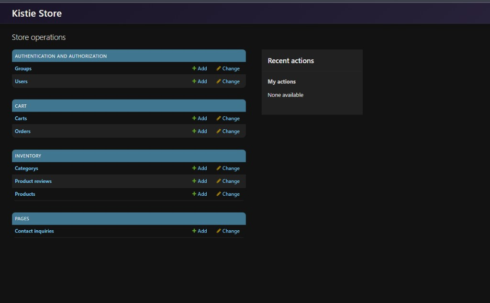
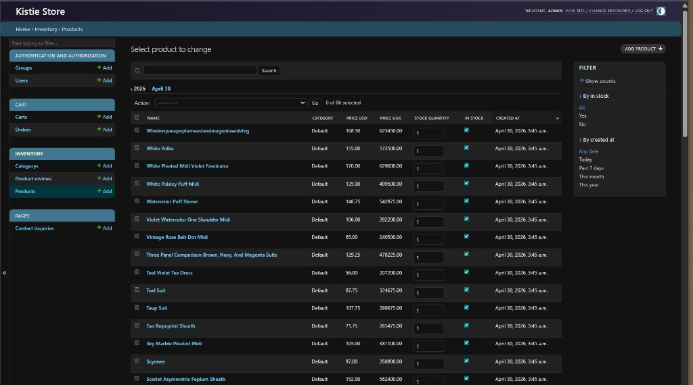

# Kistie-Store

[](https://github.com/dallas8000-ops/Kistie-Store/actions/workflows/ci.yml)

Live **fashion ecommerce** (women’s apparel & accessories)—shipping from **Kampala**, serving customers online worldwide. Production **Django** storefront + staff tooling + **DRF** API on **Render** / **PostgreSQL**, **tests + CI** on every push to `main`.

| | |
|--|--|
| **Live** | https://kistie-store.onrender.com |
| **Code** | https://github.com/dallas8000-ops/Kistie-Store |

---

## What it does (short)

**Shoppers:** catalog (filters, reviews), inventory (EU sizes, multi-currency), cart, checkout with live FX, auth, contact. **Payments** are confirmed by staff in the real world, then order status is updated in **Django admin** (typical for boutique + East Africa payment mix).

**Operations:** custom-theme **Django admin**, **staff dashboard** (`/staff/dashboard/`), **audit log** for superusers, CSRF + login throttling, **public read / staff-only write** on inventory API.

**Why this stack:** Django **SSR** for the live path (SEO, sessions, security); **React + Vite** in `frontend/` for future pages; DRF already exposes JSON for that migration.

---

## Tech (recruiter lines)

Python · **Django** · **Django REST Framework** · **PostgreSQL** (prod) / SQLite (dev) · Gunicorn · WhiteNoise · **Render** · **GitHub Actions** · Bootstrap 5 · Pillow

---

## Proof — screenshots

**In-repo gallery:** everything under [`images/screenshots/`](images/screenshots/) (storefront, brand shots, full **admin** set: login, dashboard, products, users, groups, carts, reviews, inquiries).

**Highlights:**

| Storefront | Admin |
|------------|--------|
|  |  |



**Auto-play slide deck** (storefront + admin + API summary): open [`docs/demo-presentation.html`](docs/demo-presentation.html) after `python -m http.server 8080` from repo root → `http://127.0.0.1:8080/docs/demo-presentation.html` (or use [ScreenToGif](https://www.screentogif.com/) to record a short GIF for LinkedIn).

---

## Run locally

```bash
cd backend
cp .env.example .env   # set DJANGO_SECRET_KEY
python manage.py migrate
python manage.py runserver
# http://127.0.0.1:8000/  —  createsuperuser for /admin/
```

Optional: `frontend/` and `payments/` for React/Node experiments. `render.yaml` documents production service shape.

---

## Production hardening

When **`DEBUG=False`** (Render): **HTTPS proxy headers** respected (`X-Forwarded-Proto`), **secure session + CSRF cookies**, **SSL redirect**, **`X-Frame-Options: DENY`**, structured **logging** to stdout (level via `DJANGO_LOG_LEVEL`). Optional **HSTS**: set `DJANGO_HSTS_SECONDS` (e.g. `31536000`), optionally `DJANGO_HSTS_INCLUDE_SUBDOMAINS`, `DJANGO_HSTS_PRELOAD`. **Dev CORS** for Vite runs **only when `DEBUG=True`**.

**Health checks:** `GET /health/?format=json` → `{"status":"ok","service":"kistie-store"}` for uptime monitors.

---

## CI

[`.github/workflows/ci.yml`](.github/workflows/ci.yml) — `pip install -r requirements.txt` then `cd backend && python manage.py test` on **push/PR** to `main` or `master`.

---

## Contact

**Barney R. Gilliom** — built and runs this stack for **Kistie-Store** as a live retail business.

dallas8000@gmail.com · [LinkedIn](https://www.linkedin.com/in/barney-gilliom-959981337) · [GitHub](https://github.com/dallas8000-ops) · [Portfolio](https://jnalumansi.onrender.com)

Business questions: use the **live site** contact or the email above.
